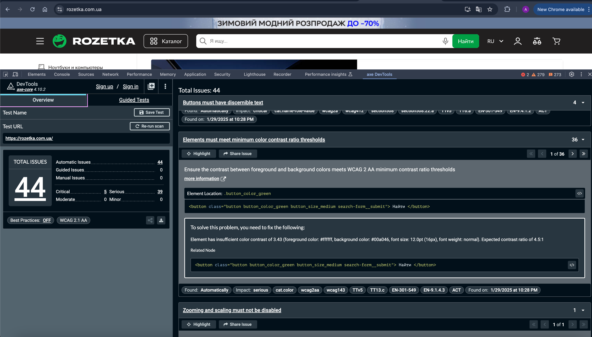

Для виправлення дефекту недостатнього контрасту між кольором тексту (foreground) і фону (background) згідно стандартів WCAG 2 AA, можна застосувати наступні способи:

1. Зміна кольору фону
Збільшити контраст фону кнопки, використовуючи темніший відтінок зеленого кольору. Наприклад:

Заміна кольору фону з #00a046 на більш темний відтінок, наприклад #00803e.
2. Зміна кольору тексту
Збільшити яскравість тексту, зробивши його темнішим. Наприклад:

Заміна білого кольору тексту #ffffff на більш темний відтінок, наприклад #333333 або #000000.
Розрахунок контрасту:
Враховуючи, що очікуваний контраст має бути мінімум 4.5:1, варто перевірити нові значення кольорів за допомогою інструментів для перевірки контрасту (наприклад, WebAIM Contrast Checker) після зміни кольорів.

Ці зміни допоможуть забезпечити доступність кнопки для людей з обмеженим зором, покращуючи видимість тексту на фоні.